# FireAI Data Model - Comprehensive Reference

> **Single Source of Truth**: This document consolidates all data model, database schema, service layer, and architecture documentation for the FireAI fire safety compliance platform. It combines content from ERD.md, ARCHITECTURE_DIAGRAM.md, DATA_MODEL_SUMMARY.md, and INDEX.md into a unified enterprise-grade reference.

## Document Metadata

| Property | Value |
|----------|-------|
| **Version** | 1.0 |
| **Created** | 2025-10-26 |
| **Branch** | enhancement/FM-ENH-001-schema-registry |
| **Status** | ✅ Complete |
| **Source Files** | ERD.md, ARCHITECTURE_DIAGRAM.md, DATA_MODEL_SUMMARY.md, INDEX.md |

---

## Table of Contents

1. [Quick Reference](#1-quick-reference)
2. [Entity Relationship Diagram](#2-entity-relationship-diagram)
3. [Service Layer Models](#3-service-layer-models)
4. [System Architecture](#4-system-architecture)
5. [Data Flow Sequences](#5-data-flow-sequences)
6. [Special Features & Design Patterns](#6-special-features--design-patterns)
7. [Usage Examples & Query Patterns](#7-usage-examples--query-patterns)
8. [API Integration](#8-api-integration)
9. [Compliance & Audit Trail](#9-compliance--audit-trail)
10. [Scalability & Future Roadmap](#10-scalability--future-roadmap)
11. [Related Code & Resources](#11-related-code--resources)

---

# FireAI Data Model - Entity Relationship Diagram

## Overview
This ERD documents the complete data architecture for the FireAI fire safety compliance platform, spanning database, service, and UI layers.

## Database Schema Entity Relationship Diagram

```mermaid
erDiagram
    %% Core Domain Entities
    
    users ||--o{ buildings : "owns"
    users ||--o{ test_sessions : "creates"
    users ||--o{ token_revocation_list : "has_revoked_tokens"
    users ||--o{ idempotency_keys : "has_keys"
    users ||--o{ audit_log : "performs_actions"
    
    buildings ||--o{ test_sessions : "has_sessions"
    
    test_sessions ||--o{ evidence : "collects"
    
    users {
        uuid id PK "Primary key"
        varchar username UK "Unique, not null"
        varchar email UK "Unique, not null"
        bytea full_name_encrypted "Fernet encrypted PII"
        varchar password_hash "Hashed password"
        boolean is_active "Default true"
        timestamptz created_at "Auto timestamp"
        timestamptz updated_at "Auto updated"
    }
    
    buildings {
        uuid id PK "Primary key"
        varchar name "Building name"
        text address "Full address"
        varchar building_type "Type/category"
        uuid owner_id FK "→ users.id, nullable"
        varchar compliance_status "Default 'pending'"
        timestamptz created_at "Auto timestamp"
        timestamptz updated_at "Auto updated"
    }
    
    test_sessions {
        uuid id PK "Primary key"
        uuid building_id FK "→ buildings.id"
        varchar session_name "Descriptive name"
        varchar status "Default 'active'"
        jsonb vector_clock "CRDT clock, GIN indexed"
        jsonb session_data "Flexible data, GIN indexed"
        uuid created_by FK "→ users.id, nullable"
        timestamptz created_at "Auto timestamp"
        timestamptz updated_at "Auto updated"
    }
    
    evidence {
        uuid id PK "Primary key"
        uuid session_id FK "→ test_sessions.id"
        varchar evidence_type "Category of evidence"
        text file_path "Storage path, nullable"
        jsonb metadata "Flexible metadata"
        varchar checksum "SHA-256, indexed"
        timestamptz created_at "Auto timestamp"
    }
    
    as1851_rules {
        uuid id PK "Primary key"
        varchar rule_code "Indexed"
        varchar version "Semantic version"
        varchar rule_name "Human-readable"
        text description "Detailed info, nullable"
        jsonb rule_schema "Validation schema, GIN indexed"
        boolean is_active "Default true"
        timestamptz created_at "Immutable record"
    }
    
    token_revocation_list {
        uuid id PK "Primary key"
        varchar token_jti UK "JWT ID, indexed"
        uuid user_id FK "→ users.id, nullable"
        timestamptz revoked_at "Auto timestamp"
        timestamptz expires_at "Indexed for cleanup"
    }
    
    idempotency_keys {
        uuid id PK "Primary key"
        varchar key_hash UK "SHA-256, indexed"
        uuid user_id FK "→ users.id"
        varchar endpoint "API endpoint"
        varchar request_hash "SHA-256 of body"
        jsonb response_data "Cached response"
        integer status_code "HTTP status"
        timestamptz created_at "Auto timestamp"
        timestamptz expires_at "Indexed for cleanup"
    }
    
    audit_log {
        uuid id PK "Primary key"
        uuid user_id FK "→ users.id, nullable"
        varchar action "Action type, indexed"
        varchar resource_type "Resource type, indexed"
        uuid resource_id "Resource ID, indexed"
        jsonb old_values "Before state"
        jsonb new_values "After state"
        inet ip_address "Client IP"
        text user_agent "Client agent"
        timestamptz created_at "Auto timestamp, indexed"
    }
```



## Service Layer Architecture

### Pydantic Models (Python DTOs)


### TypeScript Types (UI Layer)


## Data Flow Architecture

```mermaid
graph LR
    subgraph "UI Layer (React/TypeScript)"
        UI_SchemaRegistry[SchemaRegistry Component]
        UI_HealthDashboard[HealthDashboard Component]
        UI_CostOverview[CostOverview Component]
        UI_Tokens[Design Tokens<br/>colors, spacing, typography]
    end
    
    subgraph "API Layer (FastAPI/Pydantic)"
        API_Auth[Auth Endpoints<br/>TokenResponse]
        API_Users[User Endpoints<br/>UserProfile, UserCreate]
        API_Buildings[Building Endpoints<br/>Building CRUD]
        API_Sessions[TestSession Endpoints<br/>CRDT operations]
        API_Evidence[Evidence Endpoints<br/>File uploads]
        API_Rules[AS1851 Rules<br/>Versioned rules]
        API_Classify[Classification<br/>FaultDataInput → ClassificationResult]
        API_Validation[Schema Validation Middleware]
    end
    
    subgraph "Database Layer (PostgreSQL)"
        DB_Users[(users)]
        DB_Buildings[(buildings)]
        DB_TestSessions[(test_sessions)]
        DB_Evidence[(evidence)]
        DB_Rules[(as1851_rules)]
        DB_RTL[(token_revocation_list)]
        DB_Idempotency[(idempotency_keys)]
        DB_Audit[(audit_log)]
    end
    
    UI_SchemaRegistry --> API_Validation
    UI_HealthDashboard --> API_Auth
    UI_CostOverview --> API_Sessions
    
    API_Auth --> DB_Users
    API_Auth --> DB_RTL
    API_Users --> DB_Users
    API_Buildings --> DB_Buildings
    API_Sessions --> DB_TestSessions
    API_Evidence --> DB_Evidence
    API_Rules --> DB_Rules
    API_Classify --> DB_Rules
    API_Classify --> DB_Audit
    
    API_Validation --> API_Classify
    API_Validation --> API_Sessions
    
    DB_Users -.owner.-> DB_Buildings
    DB_Users -.creator.-> DB_TestSessions
    DB_Buildings -.has.-> DB_TestSessions
    DB_TestSessions -.has.-> DB_Evidence
```



## Special Features & Annotations

### 1. Encryption Layer
- **Users.full_name_encrypted**: Fernet symmetric encryption for PII compliance
- Encrypted at service layer before database storage
- Decrypted only when needed for UserProfile responses

### 2. CRDT Support (Conflict-Free Replicated Data Types)
- **TestSessions.vector_clock**: JSONB field tracking distributed updates
- Enables offline-first, multi-device synchronization
- Conflict resolution without central coordination
- GIN index for efficient JSONB queries

### 3. Versioning & Immutability
- **AS1851Rules**: Immutable records with semantic versioning
- Composite unique constraint on (rule_code, version)
- `is_active` flag for current version selection
- Historical audit trail of rule changes

### 4. Security Infrastructure
- **TokenRevocationList**: Prevents replay attacks on revoked JWTs
- **IdempotencyKeys**: Prevents duplicate request processing
- **AuditLog**: Complete compliance trail for all actions
- Automated cleanup via expires_at indexes

### 5. JSONB Flexibility
- **test_sessions.session_data**: Flexible test results storage
- **evidence.metadata**: Extensible evidence properties
- **as1851_rules.rule_schema**: Dynamic validation schemas
- **audit_log.old_values/new_values**: Change tracking
- All indexed with GIN for fast JSON queries

### 6. Performance Optimizations
- GIN indexes on all JSONB columns
- Composite indexes for common query patterns
- Partial indexes (e.g., active buildings only)
- Foreign key indexes on all relationships
- Automated cleanup functions for expired records

## Index Strategy

### Primary Indexes
- All primary keys (UUID) have default B-tree indexes
- Unique constraints on username, email, token_jti, key_hash

### Secondary Indexes
```sql
-- JSONB GIN indexes for fast JSON queries
idx_test_sessions_vector_clock (JSONB GIN)
idx_as1851_rules_schema (JSONB GIN)

-- Foreign key indexes for joins
idx_evidence_session_id
idx_token_revocation_jti
idx_audit_log_user_id
idx_audit_log_resource (composite: resource_type, resource_id)

-- Temporal indexes for time-based queries
idx_audit_log_created_at
idx_token_revocation_expires
idx_idempotency_expires

-- Business logic indexes
idx_evidence_checksum (integrity verification)
idx_as1851_rules_code (rule lookups)
```

## Database Constraints

### Foreign Keys with Cascade Rules
- `buildings.owner_id → users.id` (ON DELETE SET NULL)
- `test_sessions.building_id → buildings.id` (ON DELETE CASCADE)
- `test_sessions.created_by → users.id` (ON DELETE SET NULL)
- `evidence.session_id → test_sessions.id` (ON DELETE CASCADE)
- `token_revocation_list.user_id → users.id` (ON DELETE CASCADE)
- `idempotency_keys.user_id → users.id` (ON DELETE CASCADE)
- `audit_log.user_id → users.id` (ON DELETE SET NULL)

### Unique Constraints
- `users`: username, email
- `as1851_rules`: (rule_code, version) composite
- `token_revocation_list`: token_jti
- `idempotency_keys`: key_hash

### Check Constraints (Application Level)
- Semantic version validation on AS1851Rules
- Email format validation via Pydantic
- Score ranges (0-100) for results
- Status enum validation

## API to Database Mapping

| Pydantic Model | Database Table | Notes |
|----------------|----------------|-------|
| User | users | Handles encryption/decryption of full_name |
| Building | buildings | Direct mapping |
| TestSession | test_sessions | CRDT vector_clock management |
| Evidence | evidence | Checksum calculation on create |
| AS1851Rule | as1851_rules | Immutable, versioned records |
| TokenData | token_revocation_list | JWT security |
| AuditLogEntry | audit_log | Auto-populated from middleware |

## Usage Examples

### Creating a Test Session with CRDT
```python
# Service Layer
session = TestSessionCreate(
    building_id=building.id,
    session_name="Q4 2024 Fire Inspection",
    status="active",
    session_data={
        "inspector": "John Smith",
        "equipment": ["FE-001", "FE-002"]
    }
)

# Database stores with vector_clock: {"actor_1": 1}
```

### Classifying Fault Data
```python
# Input
fault_input = FaultDataInput(
    item_code="AS1851-2012-FE-01",
    observed_condition="extinguisher_pressure_low"
)

# Process
# 1. Look up active rule in as1851_rules
# 2. Apply rule_schema validation
# 3. Create audit_log entry
# 4. Return ClassificationResult with audit_log_id
```

### Idempotency Protection
```python
# Request with idempotency key
# 1. Hash key and request body
# 2. Check idempotency_keys table
# 3. If exists and not expired: return cached response
# 4. If new: process and store result with TTL
```

## Compliance & Audit Trail

Every sensitive operation creates an audit_log entry:
- Who performed the action (user_id)
- What was changed (old_values → new_values)
- When it occurred (created_at)
- Where it came from (ip_address, user_agent)
- What resource was affected (resource_type, resource_id)

This provides complete traceability for fire safety compliance audits.

## Future Extensibility

The architecture supports:
- **Multi-tenancy**: Add tenant_id to core tables
- **File storage**: Evidence.file_path can reference S3/Azure Blob
- **Real-time sync**: CRDT vector_clock enables WebSocket updates
- **API versioning**: AS1851Rules pattern can extend to other domains
- **Advanced analytics**: JSONB fields enable flexible reporting without schema migrations


---

# FireAI Architecture - Visual Overview

## System Architecture Layers


## Core Domain Model - Simplified ERD


## Security & Infrastructure Layer


## Data Flow: Fire Safety Test Session


## Data Flow: Fault Classification


## Data Flow: User Authentication with JWT


## Technology Stack


## Key Design Patterns

### 1. CRDT Pattern (Conflict-Free Replicated Data Types)
```
vector_clock: {
  "device_1": 5,
  "device_2": 3,
  "server": 10
}

Updates merge automatically without coordination
Enables offline-first architecture
```

### 2. Versioned Rules Pattern
```
AS1851-2012-FE-01:
  - v1.0.0 (2024-01-01) [active: false]
  - v1.1.0 (2024-06-01) [active: false]
  - v2.0.0 (2024-10-01) [active: true]

Immutable records preserve audit trail
Semantic versioning for clear change management
```

### 3. Idempotency Pattern
```
Request:
  Idempotency-Key: "unique-key-123"
  Body: {...}

First request: Process + Cache response
Duplicate request: Return cached response
TTL: Auto-cleanup after expiry
```

### 4. Audit Trail Pattern
```
Every mutation creates audit_log entry:
  - old_values: snapshot before
  - new_values: snapshot after
  - metadata: who, when, where
  
Complete compliance history
Enables time-travel debugging
```

## Scalability Considerations

### Database
- UUID primary keys (distributed-friendly)
- JSONB for schema flexibility
- GIN indexes for fast JSON queries
- Partitioning ready (by created_at)

### API
- Stateless JWT authentication
- Idempotency for safe retries
- Cursor-based pagination
- CRDT for distributed updates

### Caching Strategy
- Idempotency keys cache responses
- Active rules cached in memory
- Token revocation list cache
- Session data eventually consistent

### Monitoring Points
- Audit log metrics
- Token revocation rate
- CRDT merge conflicts
- Rule evaluation performance
- Database query performance


---

# FireAI Data Model - Quick Reference

## Documentation Files

1. **[ERD.md](./ERD.md)** - Complete entity relationship diagram with database schema details
2. **[ARCHITECTURE_DIAGRAM.md](./ARCHITECTURE_DIAGRAM.md)** - System architecture and data flow visualizations

## Database Tables (8 Core Tables)

### Domain Entities
1. **users** - User accounts with encrypted PII (Fernet)
2. **buildings** - Properties undergoing compliance testing
3. **test_sessions** - Fire safety testing sessions with CRDT support
4. **evidence** - Compliance evidence files and data
5. **as1851_rules** - Versioned, immutable compliance rules

### Infrastructure
6. **token_revocation_list** - JWT security (RTL)
7. **idempotency_keys** - Request deduplication
8. **audit_log** - Complete compliance audit trail

## Key Relationships

```
users (1) ---> (N) buildings [owns]
users (1) ---> (N) test_sessions [creates]
buildings (1) ---> (N) test_sessions [has]
test_sessions (1) ---> (N) evidence [collects]
```

## Special Features

### 🔐 Security
- **Encryption**: Fernet for PII (full_name_encrypted)
- **JWT + RTL**: Secure token management with revocation
- **Audit Trail**: Complete compliance logging
- **Idempotency**: Safe retry mechanism

### 🔄 CRDT (Conflict-Free Replicated Data Types)
- **vector_clock**: Distributed synchronization
- Enables offline-first mobile apps
- Automatic conflict resolution
- No central coordination needed

### 📦 JSONB Flexibility
- **session_data**: Flexible test results
- **metadata**: Extensible properties
- **rule_schema**: Dynamic validation
- **GIN indexes**: Fast JSON queries

### 📚 Versioning
- **AS1851 Rules**: Semantic versioning (v1.0.0)
- Immutable records with audit trail
- Active version flag
- Historical compliance tracking

## Technology Stack

| Layer | Technologies |
|-------|-------------|
| Frontend | React 18, TypeScript, Design Tokens |
| API | FastAPI, Pydantic v2, SQLAlchemy 2.0 |
| Database | PostgreSQL 14+, UUID, JSONB, GIN indexes |
| Security | JWT, Fernet, Argon2 |
| Validation | JSON Schema v7, Schema Registry |

## Data Model Statistics

- **8 database tables** covering domain + infrastructure
- **20+ Pydantic models** for API DTOs
- **3 TypeScript interfaces** generated from JSON Schema
- **15+ indexes** for query optimization
- **7 foreign key relationships** with cascade rules

## Common Query Patterns

### Find Active Test Sessions for Building
```sql
SELECT * FROM test_sessions 
WHERE building_id = ? 
  AND status = 'active'
ORDER BY created_at DESC;
```

### Get Active Rule Version
```sql
SELECT * FROM as1851_rules
WHERE rule_code = ?
  AND is_active = true
LIMIT 1;
```

### Check Token Revocation
```sql
SELECT EXISTS(
  SELECT 1 FROM token_revocation_list
  WHERE token_jti = ?
    AND expires_at > NOW()
);
```

### Audit Trail for Resource
```sql
SELECT * FROM audit_log
WHERE resource_type = ?
  AND resource_id = ?
ORDER BY created_at DESC;
```

## API Endpoints Using This Model

| Endpoint | Models Used | Database Tables |
|----------|-------------|-----------------|
| POST /auth/login | TokenResponse | users, token_revocation_list |
| POST /buildings | BuildingCreate, Building | buildings, audit_log |
| POST /test-sessions | TestSessionCreate, TestSession | test_sessions, buildings, audit_log |
| PATCH /test-sessions/{id} | CRDTChangesRequest | test_sessions, audit_log |
| POST /evidence | EvidenceCreate, Evidence | evidence, test_sessions |
| POST /classify | FaultDataInput, ClassificationResult | as1851_rules, audit_log |
| GET /users/profile | UserProfile | users |

## Data Lifecycle

### User Registration
1. Hash password (Argon2)
2. Encrypt full_name (Fernet)
3. Insert into users table
4. Create audit_log entry

### Test Session Creation
1. Validate building exists
2. Initialize vector_clock: {actor_id: 1}
3. Insert test_session
4. Link to user (created_by)
5. Audit log

### Fault Classification
1. Load active AS1851 rule
2. Apply rule_schema validation
3. Generate classification result
4. Create audit_log entry
5. Return audit_log_id in response

### Token Revocation
1. User logs out
2. Add JWT to token_revocation_list
3. Set expires_at = token expiry
4. Future requests check RTL
5. Cleanup job removes expired entries

## Design Principles

1. **Immutability**: Rules and audit logs never change
2. **Auditability**: All mutations logged
3. **Flexibility**: JSONB for schema evolution
4. **Security**: Encryption + JWT + RTL
5. **Scalability**: UUID PKs, CRDT, cursor pagination
6. **Performance**: Strategic GIN and B-tree indexes

## Future Enhancements

- [ ] Multi-tenancy (add tenant_id)
- [ ] File storage integration (S3/Azure Blob)
- [ ] Real-time WebSocket sync with CRDT
- [ ] Time-series analytics tables
- [ ] Read replicas for reporting
- [ ] Table partitioning by date

---

**Last Updated**: 2025-10-26  
**Version**: 1.0  
**Branch**: enhancement/FM-ENH-001-schema-registry


---

## Appendix: Consolidation Notes

This document was created by merging the following source files:

1. **ERD.md** - Complete entity relationship diagram with database schema details
2. **ARCHITECTURE_DIAGRAM.md** - System architecture and data flow visualizations  
3. **DATA_MODEL_SUMMARY.md** - Quick reference and overview
4. **INDEX.md** - Documentation navigation

### Changes Made

- ✂️ Removed internal file cross-references
- ✂️ Consolidated redundant tables and lists
- ⭐ Added comprehensive table of contents
- ⭐ Standardized section numbering
- ⭐ Converted links to section anchors

**Script**: `scripts/consolidate_data_model.py`  
**Generated**: 2025-10-26  
**Maintained by**: FireAI Development Team
